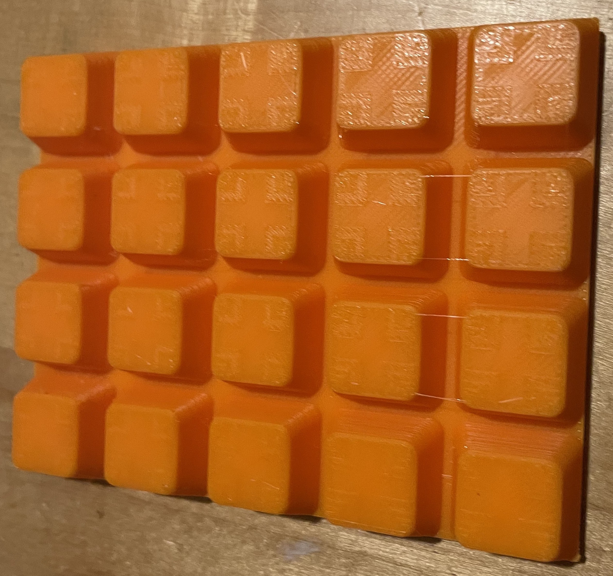
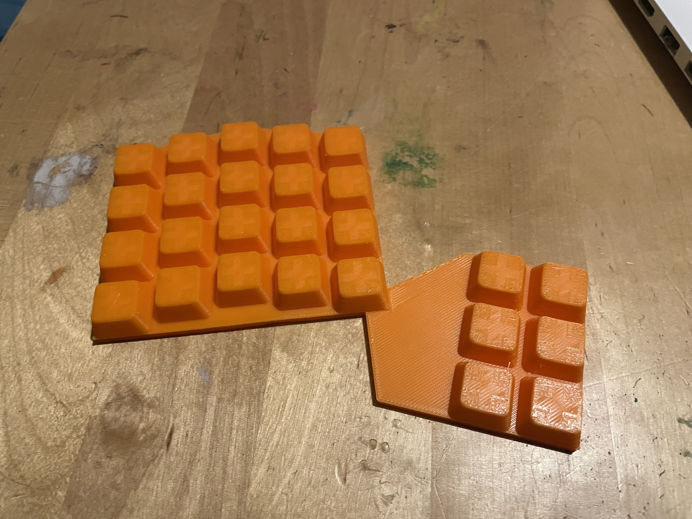
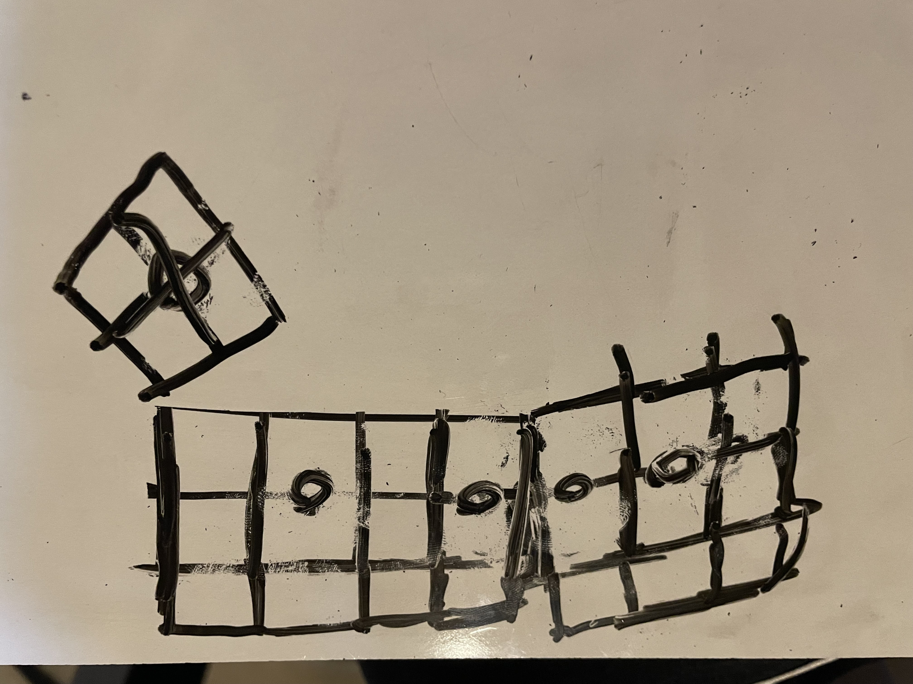
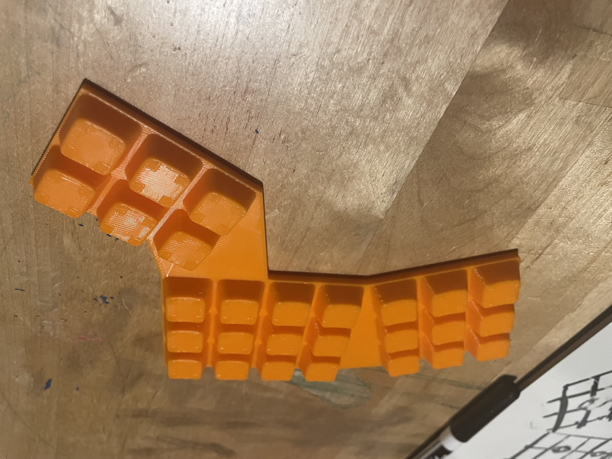
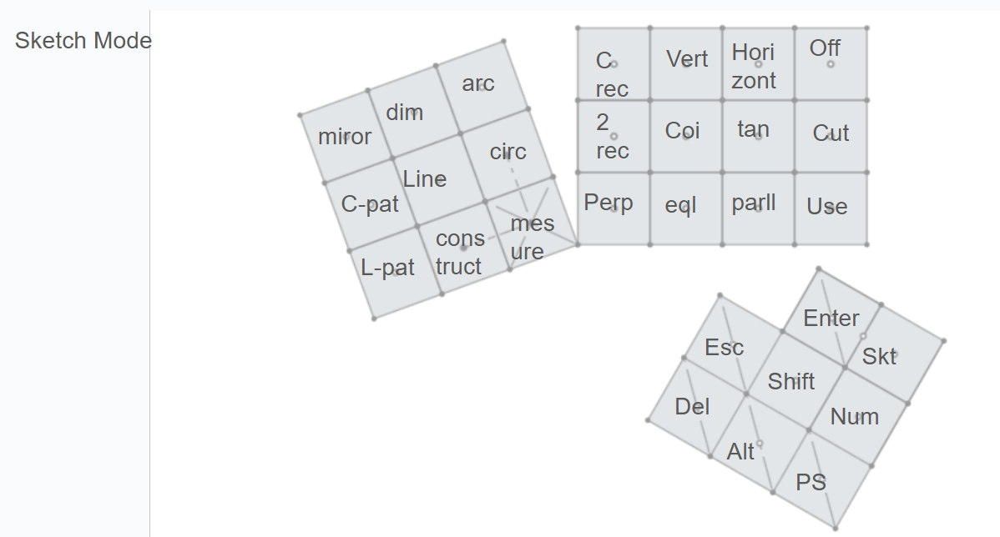
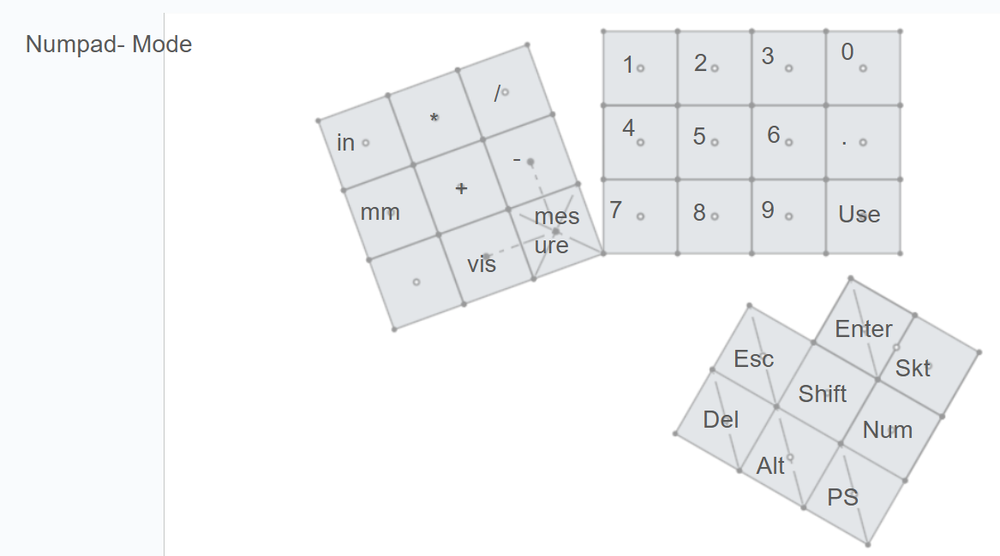
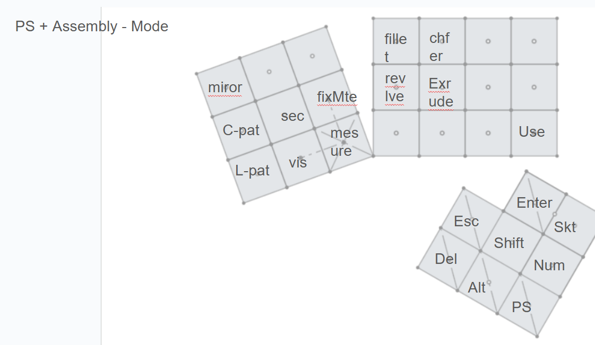

# Overview

## Goal
Make a numpad like keyboard for common CAD shortcuts so hands do not have to move between the mouse and keyboard because shortcuts are often far apart requiring hand movement

## Requirements
### Necesity
- Enough Keys for all commonly used CAD shortcuts
    - Needs to be defined further after more research
- Able to have key mapping change to different shortcuts
    - should have basic presets for different CAD programs
- Small enough to fit on desk next to laptop
- Comfortabe to use

### Nice to have
- Group similar shortcuts together
- Looks nice
- Has digits 0-9 and decimal 

 

# Journaling

### May 24
- Created my goal and started writing requirements
- Decided what shortcuts are needed for sketching
    - 6 line creation shortcuts
    - 6 line adjustment shortucts
    - 6 constraint shortcuts
    - alt, shift, esc required regardless
- I need to decide how to simplify because 21 keys is likely to many and this is before considering part-studio + assembly shortcuts
- I also started skimming through some pre-existing keyboard desgins on google and extended numpad or ergonomic style half keyboard designs seem promising but I need to nail down requirements before starting design.

** Aprox 1hr **

### May 26
- Created a spreadsheet for all the shortucts I want the keyboard to be able to produce
- Messed around with grouping 2 shortcuts per key reduce the number of keys required
    - 2 per key still requires 23 keys before even considering adding numbers
- Adding a numpad does not seem viable at this time, 3 contexts may be required rather then 2 to have it without it being the size of a full keyboard.
- I am currently leading towards the half keyboard design because it is still relitively small compared to a full sized keyboard but provides more keys with easier access then a numpad style.
- I belive that I will have to 3dp many test layouts before I find the best one.

** Aprox 0.5hr **

### May 29
- I did some research on mechanical keyboards
    - https://www.keyboard.university/100-courses was very helpful for the basics and there was one page with pictures of differnt ways to mount the pcb to the case which I suspect will be helpful when desiging the case
    - A few websites about keycaps and switches however much more research will be required before picking a style because there are far more types of each then I ever imagined there could be
    - https://www.youtube.com/watch?v=7LyziNdFlew watched this video as an intro on how to design the pcb for the keyboard
    - https://www.youtube.com/watch?v=7LyziNdFlew this was just a very cool video which ended up mostly being about the usb protocal for the keyboard

- I also printed out some basic test keyboard layouts with keycaps from here https://www.thingiverse.com/thing:4593219 so I could see what felt better

    - Numpad style (image rotated 90 deg for some reason)
        - Was not very comfortabe
        - I don't think there is any possible way to get the number of keys that I want on to this style and still have it be useable. 
        - Space is less of a constraint then I want so its smaller size is less of an advantage
        - Rectangular style makes it easier to design

    -Half Keyboard style (image also rotated 90 deg for some reason)
        - Is likeley to be able to fit the number of necessary keys (Another column to the left for the pinky can easily be used)
        - Currently the thumb keys are too far and hard to reach
        - Lower row can be hard to reach
        - Feels more comfortable for my hand

- At this point I don't see a good reason not to go with the half keyboard design since it fits all requirements and the numpad style does not.
    - More testing is needed to improve placement of the thumb keys
    - I want to test out making clear groupings of keys

** About 2-2.5 hrs **

### June 4
- I took a break to work on other projects but paid attention to how I used shortcuts while cading
    - It will be very inconvinient to not have most sketch shortcuts avalible without having to hold a modifier key
    - Having the ablility to do numpad inputs will be a necessity so I don't have to constantly switch between this keyboard and main for num inputs
    - Shortcuts have very little benefit outside of sketching. The majority of cad time is spent sketching and the only useful shortcuts in assemblys is the standard mate + visablitiy.

- With this in mind I made another prototype layout that I think is the best one yet.
    - It has 21 keys all in easy reach
    - 9 additional thumb keys
    - fairly confortable
    - One downside is that about 3 keys are a bit of a stretch to reach
- The current idea with this current prototype is to have some of the thumb keys act like a caps lock to switch between contexts. For example...
    - A sketch context
    - A Part Studio + Assembly context
    - A numpad context

- I started this prototype by drawing out designs on a white board and adjusting them until I ended up with this

- Then I laided it out in cad and printed it to test it out irl and to scale. 

- The only thing to change with this design is to replace the thumb keys with a 3x3 set of keys centered around the bottom left key to make them easier to reach and press.

- The next step now is to make a shortcut layout that I like to ensure that this design will work.

** About 45 min **

### June 5

- Planned out all the keybinds. While I'm sure they'll end up changing, it works to move on to the rest of ther projects.   