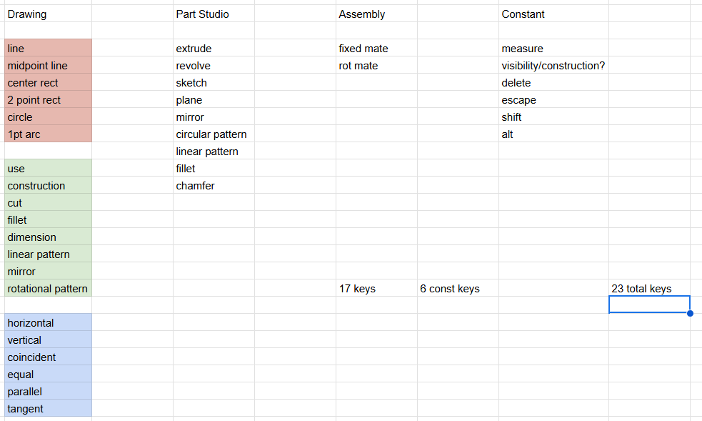

# Overview

## Goal
Make a numpad like keyboard for common CAD shortcuts so hands do not have to move between the mouse and keyboard because shortcuts are often far apart requiring hand movement

## Requirements
### Necesity
- Enough Keys for all commonly used CAD shortcuts
    - Needs to be defined further after more research
- Able to have key mapping change to different shortcuts
    - should have basic presets for different CAD programs
- Small enough to fit on desk next to laptop
- Comfortabe to use

### Nice to have
- Group similar shortcuts together
- Looks nice
- Has digits 0-9 and decimal 

 

# Journaling

### May 24
- Created my goal and started writing requirements
- Decided what shortcuts are needed for sketching
    - 6 line creation shortcuts
    - 6 line adjustment shortucts
    - 6 constraint shortcuts
    - alt, shift, esc required regardless
- I need to decide how to simplify because 21 keys is likely to many and this is before considering part-studio + assembly shortcuts
- I also started skimming through some pre-existing keyboard desgins on google and extended numpad or ergonomic style half keyboard designs seem promising but I need to nail down requirements before starting design.

** Aprox 1hr **

### May 26
- Created a spreadsheet for all the shortucts I want the keyboard to be able to produce
- Messed around with grouping 2 shortcuts per key reduce the number of keys required
    - 2 per key still requires 23 keys before even considering adding numbers
- Adding a numpad does not seem viable at this time, 3 contexts may be required rather then 2 to have it without it being the size of a full keyboard.
- I am currently leading towards the half keyboard design because it is still relitively small compared to a full sized keyboard but provides more keys with easier access then a numpad style.
- I belive that I will have to 3dp many test layouts before I find the best one.

** Aprox 0.5hr **